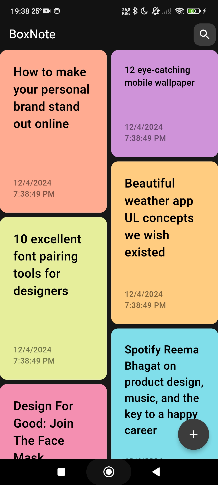
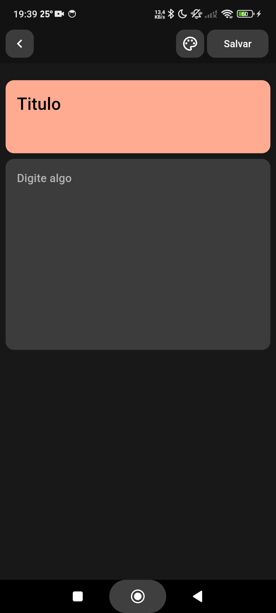
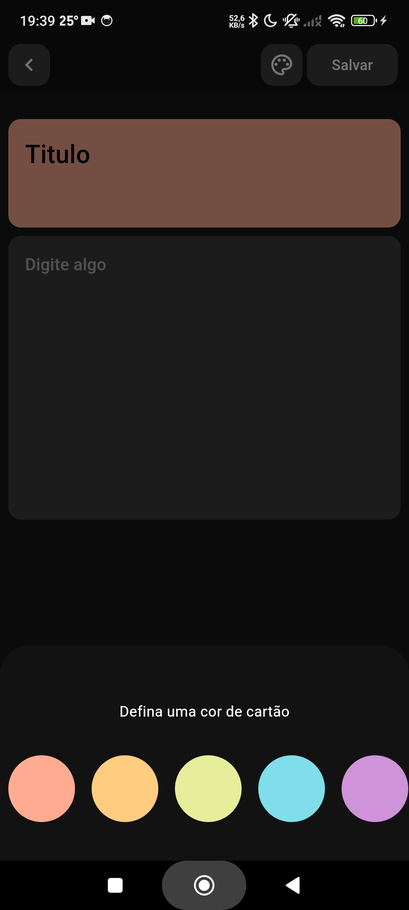

# BoxNote

Este projeto visa a criação de um aplicativo de notas simples, mas elegante

## Recursos
- Cartões e elementos elegantes
- Crie suas notas de maneira rápida
- Foco em privacidade. Todo o armazenamento de dados é armazenado de forma local.
- Exportação e Importação de dados do seu dispositivo

---

## Captura de Tela

  
  
  

*Capturas de tela*

---
